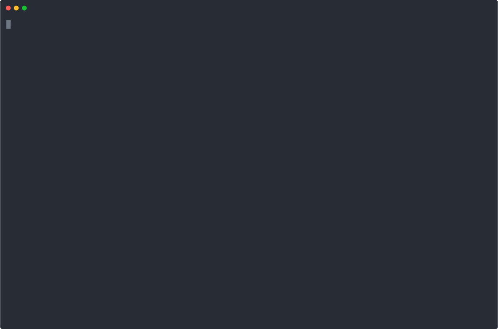

<div align="center">


<h1>bud</h1>
<p>A lightweight, keyboard-driven personal budget tracker for terminal users</p>

<a href="https://asciinema.org/connect/5b523539-0ced-456c-b68a-3637d5a2a3e2">
  
</a>

</div>

---

> [!NOTE]
> Currently only supports Linux distros. Will add Windows support soon.

## How to install?

Simply execute the following commands:

```bash
# 1. Clone the repository wherever you want
git clone https://github.com/hydraadra112/bud.git
cd bud

# 2. Make it executable
chmod +x bud.py

# 3. Symlink using the absolute current path
ln -s "$(pwd)/bud.py" ~/.local/bin/bud

# 4. Initialize the database in ~/.local/share/bud/
bud init
```

## How to use?

```bash
bud init                          # Init ledger
bud category new food             # Create category
bud deposit 2500.00               # Add global funds
bud allocate 400.00 food          # Move funds to category
bud spend 15.50 food "Burrito"    # Log expense
bud report food                   # View category status
bud dashboard                     # Visualizes your budget
bud category archive food         # Close cat, return funds
```

- Deposit fills the global pool.
- Allocate moves money from global into a category.
- Spend draws from a category first, then global if it runs short.
- Archiving a category returns whatever's left to the global pool.

## Why did I make this?

I designed this little CLI tool for managing my own budget. I prefer making things work in my own workspace rather than managing a spreadsheet. I decided to share this as well, because some terminal user out there might want to manage their budget in their terminal too.
